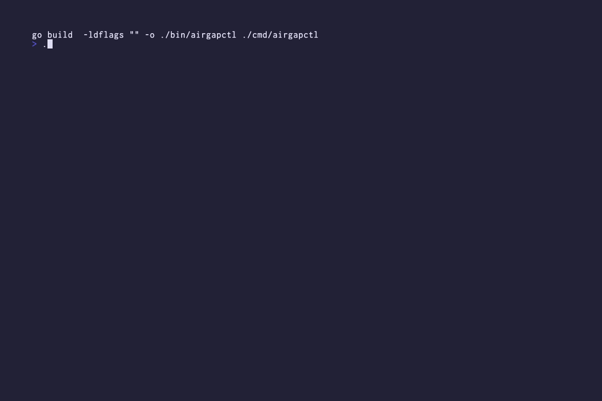

# airgapctl

A single static Go binary that loads Replicated `.airgap` bundles into a private registry and generates Helm values files — replacing the manual `docker save/load/retag/push` + hand-edit workflow.



## Problem

SREs and platform engineers deploying into air-gapped environments receive Replicated `.airgap` bundles. Getting those bundles usable means:

1. Extracting the bundle
2. `docker load` every image
3. Manually retag each one to the private registry path
4. `docker push` them all
5. Hand-edit Helm chart `values.yaml` to replace image registry references

This is tedious (dozens of images per bundle), error-prone (typos, missed images), and scales poorly (repeated per release, per environment).

`airgapctl` automates the entire consumer side of the airgap bundle pipeline.

## Features

- **Pure Go, zero runtime dependencies** — no Docker daemon, no `registry` binary, no external tooling required. The static binary is self-sufficient in air-gapped environments.
- **Direct from disk** — pushes images directly from the Docker distribution v2 registry-on-disk layout inside the `.airgap` bundle, no temporary `registry serve` process.
- **Multi-arch aware** — correctly pushes manifest lists and all platform-specific manifests so `linux/amd64`, `linux/arm64`, and others remain pullable.
- **Idempotent** — re-running against the same bundle and destination registry skips already-present images without error.
- **Chart-aware values generation** — reads your Helm chart's `values.yaml` and generates a values file with only the images that chart actually references, mapped to their new registry paths.
- **Progress reporting** — real-time progress with `[3/12]` counters, elapsed time, and per-image success/skip/failure summaries.
- **Flexible auth** — supports username/password, bearer tokens, and automatic fallback to `~/.docker/config.json` (including `DOCKER_CONFIG` override).
- **TLS control** — skip verification or provide a custom CA certificate for self-hosted registries.

## Installation

### With Nix (recommended)

If you have [Nix](https://nixos.org/download.html) with flakes enabled and [direnv](https://direnv.net/):

```bash
git clone https://github.com/crdant/airgapctl.git
cd airgapctl
direnv allow
# All tools (Go, VHS, ttyd, ffmpeg, golangci-lint) are provided automatically
make build
```

### Manual

```bash
git clone https://github.com/crdant/airgapctl.git
cd airgapctl
make build
# or: go build -o bin/airgapctl ./cmd/airgapctl
```

**Prerequisites:**
- Go 1.25 or later
- Make

The resulting binary at `./bin/airgapctl` is statically linked and has zero runtime dependencies.

## Usage

`airgapctl` has three primary commands: `list`, `push`, and `values`. Every command requires `--bundle <path>` (or a positional argument).

### `list` — inspect bundle contents

```bash
airgapctl list --bundle my-bundle.airgap
```

Output:

```
IMAGE                    TYPE        DIGEST                PLATFORMS
nginx:latest             multi-arch  sha256:abc123...     2 (linux/amd64, linux/arm64)
redis:7                  single-arch sha256:def456...     -
postgres:15              single-arch sha256:ghi789...     -
```

### `push` — load images into a registry

Push all images from the bundle to a destination registry with progress reporting:

```bash
airgapctl push \
  --bundle my-bundle.airgap \
  --registry registry.example.com \
  --namespace myapp \
  --username $USER \
  --password $PASS
```

Output:

```
Pushing 3 images to registry.example.com
[1/3] nginx:latest
[2/3] redis:7
[3/3] postgres:15
Done in 12s — 3 pushed, 0 skipped, 0 failed
```

**Auth options:**
- `--username` + `--password`
- `--token` (bearer token)
- If neither is provided, falls back to `~/.docker/config.json`

**TLS options:**
- `--tls-skip-verify` — skip certificate verification
- `--tls-ca-cert <path>` — use a custom CA certificate

**Idempotent:** re-running the same push skips images that already exist in the destination.

### `values` — generate Helm values with remapped image paths

Generate a values file that remaps chart image references to the destination registry:

```bash
airgapctl values \
  --bundle my-bundle.airgap \
  --chart ./my-chart \
  --registry registry.example.com \
  --namespace myapp \
  --output values-airgap.yaml
```

Output:

```
Wrote values file to values-airgap.yaml (2/3 images matched)
```

The generated `values-airgap.yaml` contains only images from the bundle that the chart actually references, remapped to the destination registry. Pass it to Helm:

```bash
helm install my-release ./my-chart -f values-airgap.yaml
```

**Chart input options:**
- Local chart directory: `--chart ./my-chart`
- OCI chart reference: `--chart oci://registry.example.com/charts/my-chart --version 1.2.3`
- Chart tarball: `--chart my-chart-1.2.3.tgz`

## Development

### Running tests

```bash
make test        # unit tests (excludes E2E)
make e2e         # end-to-end tests
make coverage    # with coverage report
```

### Linting

```bash
make lint        # requires golangci-lint
```

### Regenerating the demo GIF

```bash
make demo        # requires VHS and ttyd (provided by Nix devShell)
```

## How it works

Replicated `.airgap` bundles are gzipped tar archives containing:

- `airgap.yaml` — metadata and the `SavedImages` list
- `images/docker/registry/v2/` — a Docker distribution v2 registry-on-disk layout with blobs, manifests, and repository links

`airgapctl`:

1. Extracts and parses `airgap.yaml` to discover the image list
2. Walks the Docker v2 layout to resolve manifest lists vs. single-arch manifests
3. Pushes blobs and manifests directly to the destination registry via the OCI Distribution Spec HTTP API
4. Generates a values file by matching bundle images against the target Helm chart's `values.yaml` references

All of this is done in pure Go — no Docker daemon, no `registry` binary, no external runtime dependencies.

## License

Apache 2.0 — see [LICENSE](LICENSE)
