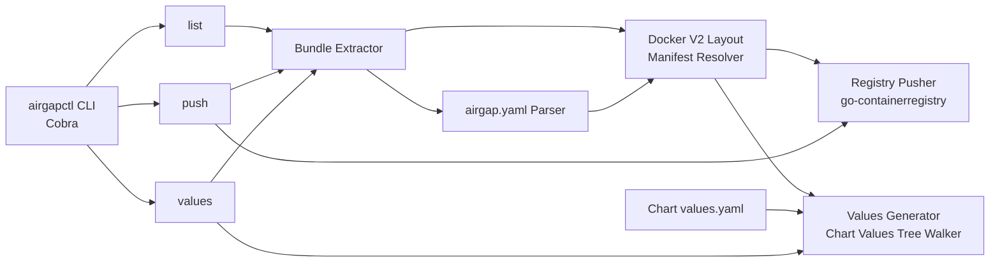

# Cobra CLI with list, push, and values subcommands

## Summary

Build `airgapctl` as a Cobra-based CLI with three subcommands — `list`, `push`, and `values` — backed by core packages that extract Replicated `.airgap` bundles, resolve Docker v2 manifest paths, push images directly to an OCI registry with multi-arch/idempotency support, and generate configurable Helm values files. go-containerregistry is chosen for mature, pure-Go registry operations from on-disk layouts.

---

## Problem Frame

SREs need discrete operations: inspecting bundle contents before pushing, pushing independently of values generation, and generating values files without registry write access. A monolithic single-command design would conflate these three independent workflows. Cobra provides the standard command framework for a polished multi-command CLI. (see origin: docs/brainstorms/2026-05-14-airgapctl-requirements.md)

---

## Requirements

- R1. Push all container images from a local `.airgap` bundle to a destination OCI-compatible registry.
- R2. Accept configurable destination registry parameters: registry URL, credentials (username/password or token), and TLS settings (skip verify, custom CA).
- R3. Report progress during image push — at minimum, images completed vs. total, with elapsed time.
- R4. Accept a local `.airgap` file path as the primary input.
- R5. Parse `airgap.yaml` from within the bundle to discover the image list (`SavedImages`) and metadata.
- R6. Generate a YAML values file that maps each original image reference to its corresponding destination registry path.
- R7. Use a standard default output filename (`values-airgap.yaml`) with a CLI flag to override. (Origin cited `images.yaml` as an example; the actual default reflects the chart-values output shape.)
- R8. Allow the destination image path to be user-configurable — control over registry host, namespace/prefix, and tag behavior.
- R9. Distribute as a single static Go binary with no external runtime dependencies.
- R10. Support the `docker` bundle format (Docker distribution v2 registry-on-disk layout).
- R11. Handle multi-architecture images correctly — push manifest list and all platform-specific manifests.
- R12. Report which images succeeded and which failed on any non-catastrophic error during push.
- R13. Support idempotent push — re-running against the same bundle and destination registry must be safe, with already-present images skipped without error.

**Origin actors:** A1 (SRE / Platform Engineer), A2 (airgapctl CLI)

**Origin flows:** F1 (Load bundle into registry + generate values), F2 (Generate values only)

**Origin acceptance examples:** AE1–AE6

---

## Scope Boundaries

- Downloading `.airgap` bundles from S3 or OCI registry (**deferred to a subsequent release**).
- Authenticating with the Replicated API (**deferred to a subsequent release**).
- Embedded cluster bundle support.
- Diff/incremental bundle support.
- Modifying Helm charts or `app.tar.gz` in place.
- Legacy `docker-archive` bundle format.
- Uploading bundles or images to S3 or any remote storage.

### Deferred to Follow-Up Work

- Custom `--template` support for `repository`+`tag` dict output format. MVP uses fixed behavior: `repository` gets `registry/namespace/name`, `tag` gets bundle's tag.
- Handling of `global.imageRegistry` pattern (where chart stores registry separately from repository). MVP treats `repository` values as complete image references including registry.
- Full YAML comment round-tripping in output. MVP preserves structure; comment preservation depends on `yaml.v3` capabilities.
- Flat `images:` mapping mode for non-chart use cases. MVP requires `--chart` for `values` subcommand.

---

## Context & Research

### Relevant Code and Patterns

- `go.mod` exists with module path `github.com/replicatedhq/airgapctl` and Go 1.25.8.
- Empty stub packages exist at `pkg/bundle/bundle.go`, `pkg/registry/registry.go`, `pkg/values/values.go`, and `internal/config/config.go`.
- No existing CLI entrypoint (`main.go`) or command structure.
- `README.md` describes a `make build` / `make test` workflow; a Makefile already exists with `build`, `test`, `lint`, and `coverage` targets.

### External References

- `github.com/google/go-containerregistry` — mature Go library for reading Docker v2 layouts and pushing to OCI registries. Used by `crane` and `kaniko`.
- `github.com/spf13/cobra` — standard Go CLI framework for subcommands, flags, and help generation.
- Docker distribution v2 on-disk layout specification — manifests stored under `images/` with repository-scoped paths and blob storage.

---

## Key Technical Decisions

- **Cobra for CLI framework**: The user explicitly requested a multi-subcommand CLI with a polished UX. Cobra provides command grouping, auto-generated help, persistent flags, and standard shell completion.
- **go-containerregistry for registry operations and push**: Chosen for its mature HTTP push implementation, manifest-list handling, and TLS/auth transport support. The bundle's on-disk layout may be Docker distribution v2 registry storage (not OCI image layout), so the resolver in U3 will perform custom directory traversal to locate manifest blobs and layer files. go-containerregistry is then used to parse the manifest JSON and push blobs/manifests to the destination registry. If the Replicated bundle turns out to use OCI image layout, `go-containerregistry`'s `layout.Path` can be used directly as a fast path.
- **Pure Go push, no temporary registry**: The push engine reads manifests and layers directly from the extracted on-disk layout and uploads via HTTP. No `registry serve` subprocess or Docker daemon required. (see origin: Key Decisions)
- **Go `text/template` for destination path templating**: Supports standard variables (`Registry`, `Namespace`, `Name`, `Tag`) with custom template functions. Used for inline image string replacements in chart values.
- **Chart-structure-preserving values generation**: The `values` subcommand reads a Helm chart's `values.yaml`, recursively detects image references (inline strings and `repository`+`tag` dicts), matches them to bundle images by normalized name, and generates an output YAML that mirrors the chart's exact tree structure with only the matched image values replaced. This produces a file directly usable with `helm install -f`.

---

## Open Questions

### Resolved During Planning

- **Which Go library for registry push?** `google/go-containerregistry`. Rationale: native v2 layout reader, battle-tested multi-arch support, pure Go.
- **How to resolve SavedImages to on-disk manifests?** Walk the extracted bundle’s `images/` directory following Docker distribution v2 on-disk conventions. For each `SavedImages` entry, resolve the repository path and manifest reference (tag or digest) to the corresponding manifest blob.
- **What template syntax for destination paths?** Go `text/template` with a struct providing `.Registry`, `.Namespace`, `.Name`, `.Tag`. Default template: `{{.Registry}}/{{.Namespace}}/{{.Name}}:{{.Tag}}`.

### Deferred to Implementation

- Exact directory structure inside Replicated `.airgap` bundles (e.g., whether manifests are under `images/_manifests/`, `images/blobs/`, or another path). Will be determined by inspecting sample bundles during U2/U3 implementation.
- Whether the values file default key should be `images`, `global.images`, or another Helm-common key. Will be informed by common Replicated chart conventions during U5.

---

## Output Structure

```
cmd/airgapctl/
  main.go              # entrypoint
  root.go              # root command + persistent flags
  list.go              # list subcommand
  push.go              # push subcommand
  values.go            # values subcommand
pkg/
  bundle/
    bundle.go          # extraction + airgap.yaml parsing
    manifest.go        # v2 layout traversal + manifest resolution
  registry/
    pusher.go          # OCI push engine (go-containerregistry)
  values/
    generator.go       # YAML values generation + templating
internal/
  config/
    config.go          # shared configuration types
```

---

## High-Level Technical Design

> *This illustrates the intended approach and is directional guidance for review, not implementation specification. The implementing agent should treat it as context, not code to reproduce.*



**Data flow:**
1. Subcommand receives `--bundle` path (or positional arg) and parses flags.
2. `Bundle Extractor` opens the `.airgap` tar, extracts contents to a temp directory.
3. `airgap.yaml Parser` reads `SavedImages` and metadata.
4. `Manifest Resolver` walks the `images/` directory, mapping each `SavedImages` entry to its manifest path and detecting manifest lists (multi-arch).
5. `list` prints the resolved images.
6. `push` hands resolved images + layers to `Registry Pusher`, which checks remote existence (idempotency), uploads missing blobs, and pushes manifests. Progress and per-image results stream back to the command.
7. `values` reads the chart's `values.yaml` tree, detects image references, matches them against `SavedImages` by normalized name, and generates a structure-preserving output YAML with matched images remapped to the destination registry.

---

## Implementation Units

### U1. Cobra CLI scaffolding and command structure

**Goal:** Create the CLI entrypoint, root command with persistent flags, and stub subcommands (`list`, `push`, `values`).

**Requirements:** R9 (Go binary distribution), CLI UX

**Dependencies:** None

**Files:**
- Create: `cmd/airgapctl/main.go`
- Create: `cmd/airgapctl/root.go`
- Create: `cmd/airgapctl/list.go`
- Create: `cmd/airgapctl/push.go`
- Create: `cmd/airgapctl/values.go`
- Verify: `Makefile` already includes `build`, `test`, and `lint` targets; no action needed unless additional targets are required.

**Approach:**
- Use `spf13/cobra` with a root command that accepts `--bundle` as a persistent flag, and also accepts the bundle path as an optional positional argument for ergonomic interactive use.
  - When both positional arg and `--bundle` are provided, `--bundle` wins.
  - When neither is provided, show concise help.
- Persistent flags: `--bundle` (airgap file path), `--verbose`.
- `list` flags: none specific.
- `push` flags: `--registry`, `--username`, `--password`, `--token`, `--tls-skip-verify`, `--tls-ca-cert`.
  - Credentials can also be supplied via environment variables (`AIRGAPCTL_REGISTRY_USERNAME`, `AIRGAPCTL_REGISTRY_PASSWORD`, `AIRGAPCTL_REGISTRY_TOKEN`) to avoid shell-history exposure. CLI flags take precedence over env vars and are intended for scripted/CI use.
  - Support reading credentials from existing Docker config (`~/.docker/config.json`) as a fallback.
- `values` flags: `--chart` (required, Helm chart directory), `--registry`, `--namespace`, `--output` (default: `values-airgap.yaml`), `--template`.
- Generate command help text following Cobra conventions.

**Patterns to follow:**
- Standard Go project layout with `cmd/<binary>/main.go`.
- Cobra’s `PreRunE` for shared validation (e.g., bundle file exists).

**Test scenarios:**
- Happy path: `airgapctl --help` lists `list`, `push`, `values` subcommands.
- Happy path: `airgapctl list --bundle /path/to/bundle.airgap` parses flags successfully.
- Happy path: `airgapctl list /path/to/bundle.airgap` parses positional arg successfully (same as `--bundle`).
- Happy path: `airgapctl list --bundle /flag/path /positional/path` uses `--bundle` value, positional ignored.
- Happy path: `airgapctl push --registry example.com` uses env vars `AIRGAPCTL_REGISTRY_USERNAME` and `AIRGAPCTL_REGISTRY_PASSWORD` when flags are omitted.
- Happy path: `airgapctl push --registry example.com` falls back to `~/.docker/config.json` credentials when neither flags nor env vars are set.
- Error path: `airgapctl push` without required `--registry` returns an error with usage hint.
- Error path: `airgapctl list --bundle /nonexistent` returns file-not-found error before reaching core logic.
- Error path: `airgapctl values --bundle bundle.airgap` without required `--chart` returns clear error.

**Verification:**
- `go build ./cmd/airgapctl` produces a binary.
- `make test` runs unit tests for flag parsing.
- `--help` output for each subcommand is accurate and complete.

---

### U2. Bundle extraction and airgap.yaml parsing

**Goal:** Extract `.airgap` archives and parse `airgap.yaml` to discover the image list and metadata.

**Requirements:** R4, R5

**Dependencies:** U1 (command structure to call it)

**Files:**
- Modify: `pkg/bundle/bundle.go`
- Create: `pkg/bundle/bundle_test.go`

**Approach:**
- `.airgap` files are tar archives. Extract to a temporary directory using the stdlib `archive/tar`.
- Locate and parse `airgap.yaml` into a struct capturing `SavedImages` (slice of strings) and any metadata fields needed for downstream processing.
- Expose an API like `Open(path string) (*Bundle, error)` that returns the extracted bundle with a cleanup method.

**Patterns to follow:**
- Standard Go error wrapping (`fmt.Errorf` with `%w`).
- Table-driven tests for parsing edge cases.

**Test scenarios:**
- Happy path: valid `.airgap` bundle extracts successfully and `airgap.yaml` parses with expected `SavedImages`.
- Edge case: bundle with empty `SavedImages` list returns empty slice without error.
- Error path: invalid or truncated tar archive returns extraction error.
- Error path: tar archive missing `airgap.yaml` returns a clear "missing airgap.yaml" error.

**Verification:**
- Unit tests pass with a test fixture bundle (a small tar with a dummy `airgap.yaml`).
- `list` subcommand can invoke this package and print raw `SavedImages`.

---

### U3. Docker v2 layout traversal and manifest resolution

**Goal:** Map `SavedImages` entries to actual manifest paths and detect multi-arch manifest lists within the extracted bundle.

**Requirements:** R5, R10, R11

**Dependencies:** U2

**Files:**
- Create: `pkg/bundle/manifest.go`
- Create: `pkg/bundle/manifest_test.go`

**Approach:**
- Walk the `images/` directory of the extracted bundle following Docker distribution v2 on-disk conventions.
- For each image name in `SavedImages`, resolve the repository path to find the manifest blob (by tag or digest reference).
- Detect `mediaType` of the manifest: `application/vnd.docker.distribution.manifest.list.v2+json` (or OCI equivalent) indicates a multi-arch manifest list; `application/vnd.docker.distribution.manifest.v2+json` indicates a single-arch manifest.
- For manifest lists, collect all child platform-specific manifest references.
- Return a resolved image struct that includes: original name, manifest path, manifest type, and child manifests (for lists).

**Technical design:** *(directional guidance)*

```
SavedImages entry: "registry.example.com/myapp:v1.2.3"
  -> Walk images/ to find repository "myapp" under the registry path
  -> Resolve tag "v1.2.3" to manifest digest
  -> Read manifest JSON to determine type (single vs list)
  -> If list, enumerate platform manifests (linux/amd64, linux/arm64, etc.)
```

**Patterns to follow:**
- Keep manifest parsing thin; delegate blob reading to `go-containerregistry` types where possible (`v1.Manifest`, `v1.Index`).
- Use `path/filepath` for cross-platform path joining inside the extracted bundle.

**Test scenarios:**
- Happy path: single-arch image resolves to one manifest path with correct digest.
- Happy path: multi-arch manifest list resolves to the list plus all platform-specific child manifests (covers AE6 intent).
- Edge case: `SavedImages` entry not found in the v2 layout returns a clear resolution error.
- Error path: malformed manifest JSON (invalid mediaType or missing layers) returns a parsing error.
- Edge case: manifest list with no platform manifests returns empty children without panic.

**Verification:**
- Unit tests pass with test fixture manifests (valid single-arch, valid multi-arch, malformed JSON).
- `list` subcommand prints resolved manifests (including architecture for multi-arch images).

---

### U4. Registry push engine with multi-arch and idempotency

**Goal:** Push images directly from the Docker v2 on-disk layout to a destination OCI registry, with idempotency checks, progress reporting, and per-image success/failure tracking.

**Requirements:** R1, R2, R3, R11, R12, R13

**Dependencies:** U3

**Files:**
- Modify: `pkg/registry/registry.go`
- Create: `pkg/registry/pusher.go`
- Create: `pkg/registry/pusher_test.go`

**Approach:**
- Use `google/go-containerregistry` to read images from the local v2 layout (`layout.Path`).
- For each resolved image:
  - Authenticate to the destination registry using provided credentials (basic auth or bearer token).
  - Configure TLS (skip verify, custom CA) via `transport` options.
  - Check if the manifest already exists in the destination (HEAD request) — if yes, skip (idempotency).
  - If not present, push the manifest and all referenced layer blobs.
- For multi-arch manifest lists: push the list manifest first, then recursively push all platform-specific manifests.
- Report progress via a callback interface: `func(current, total int, elapsed time.Duration, imageName string, err error)`.
- Collect per-image results (success/skipped/failed) and return a summary.

**Technical design:** *(directional guidance)*

```
for each image in resolved list:
  if manifest exists in dest:
    mark skipped, continue
  read manifest + layers from v2 layout (go-containerregistry)
  upload layers (blob PUT)
  upload manifest (manifest PUT)
  report progress callback
  on error: collect failure, continue to next image (non-fatal)
return summary: total, pushed, skipped, failed, errors
```

**Patterns to follow:**
- Separate authentication and transport setup from push logic for testability.
- Use interface-based progress callback to allow CLI formatting (e.g., `[3/12] pushing registry.example.com/...`).

**Test scenarios:**
- Happy path: push a single-arch image to a registry (covers AE1 intent).
- Happy path: push a multi-arch manifest list with all platform manifests (covers AE6).
- Integration: re-pushing the same bundle skips already-present images (covers AE5, R13).
- Error path: registry authentication failure (401/403) is captured as a per-image failure.
- Error path: network timeout or unreachable registry is captured and reported.
- Edge case: mixed success/failure during a batch push — 7 succeed, 3 fail, summary lists each (covers AE5, R12).
- Edge case: push of an empty layer manifest does not panic.

**Verification:**
- Unit tests pass against a local test registry (or mocked registry transport).
- `push` subcommand prints progress and a final summary matching AE3 and AE5 expectations.
- Re-running `push` against the same bundle and registry reports skips for existing images.

---

### U5. Chart-structure-preserving values file generation

**Goal:** Read a Helm chart's `values.yaml`, detect all image references within it, match them to bundle images, and generate an output YAML that preserves the chart's exact tree structure with matched images remapped to the destination registry.

**Requirements:** R6, R7, R8

**Dependencies:** U2 (for image list)

**Files:**
- Modify: `pkg/values/values.go`
- Create: `pkg/values/generator.go`
- Create: `pkg/values/generator_test.go`

**Approach:**
- `--chart` flag specifies a Helm chart directory. The generator reads `<chart-dir>/values.yaml`.
- Recursively walk the parsed YAML tree using `gopkg.in/yaml.v3`.
- **Image reference detection heuristics:**
  - **Inline string**: Any string value that parses as a valid container image reference (`registry.io/namespace/name:tag` or `name:tag`). Use a lightweight parser (e.g., `reference.Parse` from `go-containerregistry` or equivalent) to validate.
  - **Repository+tag dict**: A map/dict node containing exactly `repository` and `tag` string keys (and optionally `registry` or `pullPolicy`). This is the standard Helm image convention.
- **Normalization for matching:**
  - Parse both the chart-detected reference and each bundle `SavedImages` entry into components: registry, namespace, name, tag.
  - Default registry to `docker.io` when omitted (both in chart references and bundle references).
  - For matching: compare by `registry/namespace/name` (full path). Tags are intentionally ignored in matching — charts often omit tags (relying on `latest` or chart defaults), while the bundle contains the definitive pinned version.
  - If multiple bundle images match the same chart reference (different tags), use the first match found in `SavedImages`.
- **Replacement:**
  - For inline strings: replace the node value with the full destination reference string (`registry/namespace/name:bundleTag`).
  - For `repository`+`tag` dicts: replace the `repository` value with `registry/namespace/name` and the `tag` value with the bundle's tag.
  - Preserve all other nodes (keys, comments where possible, structure) unchanged.
- Write the transformed tree to `--output` (default: `values-airgap.yaml`).
- **Template override (`--template`):** When provided, use Go `text/template` to format inline string replacements. Default template: `{{.Registry}}/{{.Namespace}}/{{.Name}}:{{.Tag}}`. Template does not affect `repository`+`tag` dicts (those use fixed behavior in MVP).

**Technical design:** *(directional guidance)*

```
Input: chart values.yaml tree + bundle SavedImages + destination config (registry, namespace)

Walk chart tree depth-first:
  if node is string and parses as image reference:
    normalize -> (registry, namespace, name, tag)
    find bundle image matching by (registry, namespace, name) [tag ignored]
    if match:
      render destination: registry/namespace/name:bundleTag
      replace node value
  if node is map with "repository" and "tag" keys:
    normalize repository value
    find bundle image matching by (registry, namespace, name)
    if match:
      replace "repository" with registry/namespace/name
      replace "tag" with bundleTag
  recursively process children

Output: modified tree serialized to YAML
```

**Patterns to follow:**
- Use `gopkg.in/yaml.v3` for parsing and serialization to preserve structure and comments where possible.
- Keep image parsing thin; reuse `reference.Parse` from `go-containerregistry` or write a lightweight normalizer.
- Table-driven tests with multiple chart YAML shapes.

**Test scenarios:**
- Happy path: chart with inline image strings generates output with same structure, images replaced by destination registry paths (covers AE2, R6).
- Happy path: chart with `repository`+`tag` dicts generates output with repository and tag replaced separately (covers R6).
- Happy path: chart references omit `docker.io` prefix but bundle has it; matching succeeds by normalization.
- Happy path: chart reference has no tag; matches bundle image by name and inherits bundle tag.
- Happy path: `--namespace mycorp` applies to all replaced images (covers AE4).
- Happy path: deeply nested image references (e.g., `sidecars[].image`) are correctly detected and replaced.
- Edge case: chart with no image references produces output identical to input.
- Edge case: bundle has images not referenced by chart; output preserves original chart values unchanged.
- Edge case: chart references images not in bundle; output preserves original values and emits a warning listing unmatched references.
- Error path: `--chart` points to a directory with no `values.yaml` returns clear error.
- Error path: invalid `--template` syntax returns clear parse error with offending line.
- Error path: destination registry not provided (`--registry` omitted and no default) returns error.

**Verification:**
- Unit tests produce expected YAML output for given chart inputs and bundle images, preserving non-image keys.
- `values` subcommand writes a file that can be passed to `helm install -f <chart> -f values-airgap.yaml` without manual editing.
- Output YAML structure exactly mirrors input chart `values.yaml` structure (verified by deep comparison in tests).
- `--output` flag correctly changes the written file path.

---

### U6. Subcommand implementations (list, push, values)

**Goal:** Wire the core packages to Cobra command handlers, implementing the full behavior of `list`, `push`, and `values`.

**Requirements:** All R-IDs via subcommand UX; AE1–AE6

**Dependencies:** U1, U2, U3, U4, U5

**Files:**
- Modify: `cmd/airgapctl/list.go`
- Modify: `cmd/airgapctl/push.go`
- Modify: `cmd/airgapctl/values.go`

**Approach:**
- `list`:
  - Call `bundle.Open` and manifest resolver.
  - Print a table: original image name, resolved manifest type (single/list), and platforms (for lists).
- `push`:
  - Call `bundle.Open`, manifest resolver, then registry pusher.
  - Print progress updates (e.g., `[3/12] 25s  pushing nginx:1.25`).
  - On completion, print summary: total, pushed, skipped, failed, elapsed time.
  - Exit with non-zero status if any image failed.
- `values`:
  - Call `bundle.Open` and values generator with the required `--chart` directory.
  - The generator reads the chart's `values.yaml`, detects image references, matches them to bundle images, and produces a structure-preserving output file.
  - Write YAML to `--output` path.
  - Print confirmation message with file path, matched image count, and count of unmatched chart references (if any).

**Execution note:** Implement `push` end-to-end test with a local registry container to verify integration between manifest resolution and registry push.

**Patterns to follow:**
- Keep command handlers thin; delegate to core packages.
- Use `os.Exit` with appropriate codes (0 for success, 1 for errors, 2 for partial push failures).
- Format output for human readability; consider tabwriter for `list` table output.

**Test scenarios:**
- Integration: `list` on a test bundle prints all images with correct architecture info.
- Integration: `push` on a test bundle against a local registry pushes all images and prints progress (covers AE3 intent).
- Integration: `values --chart <chart-dir>` on a test bundle writes a YAML file that preserves chart structure and replaces only matched images with destination paths (covers AE2, AE4, R6).
- Integration: `values --chart <chart-dir>` on a test chart with `repository`+`tag` dicts produces output with repository and tag correctly separated.
- Integration: `values` without `--chart` returns clear error indicating `--chart` is required.
- Error path: all subcommands report a clear error when the bundle file does not exist.
- Error path: `push` reports per-image failures without crashing the entire operation (covers R12).

**Verification:**
- `go test ./cmd/airgapctl/...` passes (integration tests with test fixtures).
- Manual smoke test: build the binary and run each subcommand against a real `.airgap` bundle.
- `make test` and `make build` succeed.

---

## System-Wide Impact

- **Interaction graph:** The three subcommands are independent entry points that share the `bundle` and `manifest` resolution packages. No callbacks, middleware, or observers are introduced.
- **Error propagation:** Errors from core packages bubble up to command handlers. Non-fatal push errors (R12) are collected into a summary rather than aborting the entire operation.
- **State lifecycle risks:** The bundle extractor creates a temporary directory. It must be cleaned up on success or failure to avoid disk leaks.
- **API surface parity:** N/A — this is a new CLI with no existing API consumers.
- **Integration coverage:** End-to-end tests for `push` should verify the full chain: bundle extraction → manifest resolution → registry push → idempotency check.
- **Unchanged invariants:** None — this is greenfield work. Existing stub files (`pkg/bundle/bundle.go`, `pkg/registry/registry.go`, `pkg/values/values.go`) will be rewritten with actual implementations.

---

## Risks & Dependencies

| Risk | Mitigation |
|------|------------|
| Exact Docker v2 layout inside Replicated bundles differs from standard spec | Inspect sample bundles during U2/U3 implementation; adjust manifest resolver to match actual layout. |
| go-containerregistry does not natively read Docker distribution registry storage format | U3 implements custom directory traversal to locate manifests and blobs; go-containerregistry is used for manifest parsing and push operations only. |
| Local test registry unavailable for integration tests | Use a mocked registry transport in unit tests; reserve container-based tests for manual smoke testing. |
| Chart values YAML uses unconventional image reference patterns not detected by heuristics | Document supported patterns (inline strings, `repository`+`tag` dicts); unmatched references are preserved with warnings.
| False-positive image reference detection in chart values (non-image strings that parse as images) | Rare but possible; heuristic tuned to minimize false positives. User can review warnings of unmatched references.

---

## Documentation / Operational Notes

- Update `README.md` with usage examples for each subcommand after U6 is complete, including credential sources (env vars, docker config), the `--chart` values generation workflow, and supported chart image patterns.
- Add a `docs/usage.md` (optional) documenting the template syntax for `--template`, the `--chart` structure-preserving behavior, and supported image reference patterns in chart values.
- The `Makefile` should include `build`, `test`, `lint`, and `clean` targets.

---

## Sources & References

- **Origin document:** [docs/brainstorms/2026-05-14-airgapctl-requirements.md](docs/brainstorms/2026-05-14-airgapctl-requirements.md)
- Related code: `pkg/bundle/bundle.go`, `pkg/registry/registry.go`, `pkg/values/values.go`, `internal/config/config.go`
- External docs:
  - [go-containerregistry](https://github.com/google/go-containerregistry)
  - [Cobra](https://github.com/spf13/cobra)
  - [Docker Distribution v2 Spec](https://distribution.github.io/distribution/spec/)
